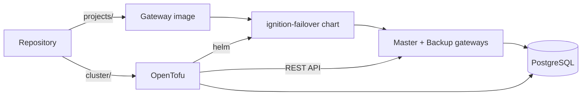

The demo treats every part of an Ignition deployment as code, and gives each setting exactly one owner. Nothing is configured by hand in a deployed gateway, and nothing is managed from two places at once.

## Overview

1. **The gateway image** bakes the projects from `projects/` into Ignition.
2. **OpenTofu** installs the [ignition-failover](https://apollogeddon.github.io/ignition-helm/) Helm chart, which runs that image as a redundant pair, plus the database.
3. **OpenTofu** then creates the running gateway's resources through its REST API with the [Ignition provider](https://apollogeddon.github.io/ignition-tfpl/) (the `resources` module).

## Who owns what

| Owner | Owns |
| --- | --- |
| The gateway image | Project contents: views, scripts, named queries, UDT definitions |
| The Helm chart | Redundancy, the Gateway Network, certificates, Pod Security |
| OpenTofu (`resources`) | Gateway resources: database connections, alarm journals, providers, users |

Projects are deliberately **not** managed through the REST API. The image is their single source, so a gateway never drifts from the tag it runs.

## Why the projects live in the image

- **One source of truth.** The tag a gateway runs fully describes its projects; there is nothing to drift.
- **Redundancy.** Master and Backup run the same image, so they always have the same projects, independent of redundancy sync.
- **Rollback.** Rolling back is deploying the previous tag.

The flip side is that a deployed gateway's projects are read-only in practice: Designer edits there are lost on the next restart. Make changes against the [develop stack](../../components/develop/), where the project folders are mounted live, and commit them.

## Two-stage deployment

Each environment is applied in two stages, because the Ignition provider can only connect once the gateway is running:

| Stage | Providers | Creates |
| --- | --- | --- |
| `infra` | kubernetes, helm | The namespace, the database and the gateway |
| `config` | ignition | The gateway's configuration; it reads the database details from the `infra` state |

## Repository layout

| Path | What it holds |
| --- | --- |
| `projects/library/` | An inheritable project: shared scripts, styles, views and UDT definitions |
| `projects/project/` | The application project; inherits from `library` |
| `gateway/` | The gateway image: Ignition plus the projects |
| `cluster/modules/` | OpenTofu modules: `platform`, `gateway`, `resources` |
| `cluster/environments/` | One root module per environment (`k3s` is the reference) |
| `database/` | The application's schema and seed data |
| `develop/` | Docker Compose for local development, with the projects mounted live |
| `scripts/` | Repository tooling: the resource sanitiser and git setup |
