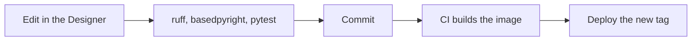

Every change follows the same path: edit against a local gateway, check the scripts outside it, commit a clean diff, and ship a new image tag.



## 1. Edit

Start the [develop stack](../../components/develop/) and edit in the Designer. The gateway rescans the project folders every 10 seconds, so you can also edit files in an editor and see them in the gateway.

## 2. Check

Gateway scripts run on Jython 2.7, but the checks run them under Python 3.12 with the [Ignition API stubs](https://pypi.org/project/ignition-api-stubs/):

```sh
cd projects
uv sync
uv run ruff format --check . && uv run ruff check .
uv run basedpyright
uv run poe compat
uv run pytest
```

`poe compat` checks that the scripts stay valid Jython 2.7, which Python 3.12 can't tell you.

`conftest.py` registers mocks for the `system.*` modules, so scripts import under pytest exactly as they do in the gateway. See [Projects](../../components/projects/#script-conventions) for the conventions that make this work.

## 3. Commit

The resource sanitiser runs as a git filter (enabled once with `scripts/setup-git.sh`). It rewrites the fields the Designer changes on every save, so a commit only shows what actually changed.

Commit messages follow [Conventional Commits](https://www.conventionalcommits.org/) (`feat: ...`, `fix(webpage): ...`). Running `npm ci` at the repository root installs the lefthook hooks: one checks commit messages, and the pre-commit hooks run ruff on staged Python files, the Jython compatibility check when a script changes, and shellcheck on staged shell scripts.

## 4. Ship

CI runs on every pull request and every push to `main`. On a pull request, each job runs only when its own files changed:

| Job | What it checks |
| --- | --- |
| Projects | forgepy's `testing.yml`, once per Ignition API (8.1 and 8.3): ruff format and lint, basedpyright, the Jython 2.7 compatibility check, the forgepy config drift check, pytest and OSV-Scanner |
| Resources and scripts | shellcheck, the sanitiser's and the image scripts' tests, that every committed `resource.json` is clean, and that the 8.1 event scripts are up to date |
| OpenTofu and config scan | `tofu fmt`, `tofu validate` for the modules and the `infra` stage, and a Trivy misconfiguration scan |
| Gateway image | builds and smoke-tests the image for 8.1.55 and 8.3.10; on `main`, publishes it to GHCR |
| Markdown | markdownlint over every Markdown file |
| Website | forgejs's `website.yml`: Gitleaks over the repository, OSV-Scanner, Biome, the type check and the build; on `main`, deploys this site to GitHub Pages |

On `main`, release-please keeps a release pull request open with the next version and changelog, generated from the Conventional Commits. Merging it creates the release, and the same run publishes the release's images.

Every published tag starts with the Ignition version:

| Tag | Published |
| --- | --- |
| `<ignition version>-main`, e.g. `8.3.10-main` | Every push to `main` |
| `<ignition version>-sha-<commit>` | Every push to `main` |
| `<ignition version>-<release version>`, e.g. `8.3.10-1.0.0` | Each release |

To deploy, set the new image tag in the environment and apply it. Because the projects are in the image, a rollback is deploying the previous tag.
