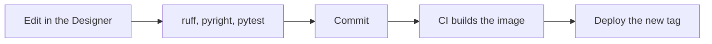

Every change follows the same path: edit against a local gateway, check the scripts outside it, commit a clean diff, and ship a new image tag.



## 1. Edit

Start the [develop stack](../../components/develop/) and edit in the Designer. The gateway rescans the project folders every 10 seconds, so you can also edit files in an editor and see them in the gateway.

## 2. Check

Gateway scripts run on Jython 2.7, but the checks run them under Python 3.12 with the [Ignition API stubs](https://pypi.org/project/ignition-api-stubs/):

```sh
cd projects
uv sync
uv run ruff format --check . && uv run ruff check .
uv run pyright
uv run pytest
```

`conftest.py` registers mocks for the `system.*` modules, so scripts import under pytest exactly as they do in the gateway. See [Projects](../../components/projects/#script-conventions) for the conventions that make this work.

## 3. Commit

The resource sanitiser runs as a git filter (enabled once with `scripts/setup-git.sh`). It rewrites the fields the Designer changes on every save, so a commit only shows what actually changed.

Commit messages follow [Conventional Commits](https://www.conventionalcommits.org/) (`feat: ...`, `fix(webpage): ...`). Running `npm ci` at the repository root installs the lefthook hook that checks them.

## 4. Ship

CI runs on every pull request and on `main`:

| Job | What it checks |
| --- | --- |
| Projects | ruff format and lint, pyright, pytest |
| Sanitised resources | the sanitiser's own tests, and that every committed `resource.json` is clean |
| OpenTofu | `tofu fmt` and `tofu validate` for the modules and the `infra` stage |
| Gateway image | builds the image; on `main` and `v*` tags, publishes it to GHCR |
| Webpage quality | Gitleaks over the repository, OSV-Scanner, Biome and the type check, from forgejs's `quality.yml` |
| Markdown | markdownlint over every Markdown file |
| Webpage build | builds this site; on `main`, deploys it to GitHub Pages |

Deploying is then a matter of setting the new image tag in the environment and applying it. Because the projects are in the image, a rollback is deploying the previous tag.
